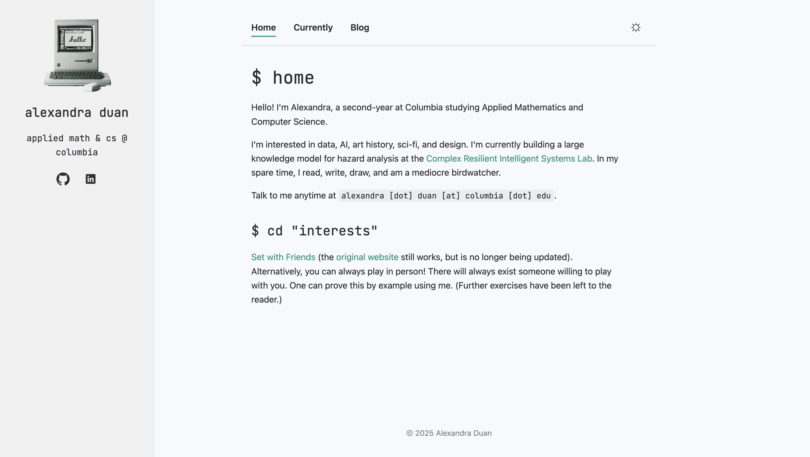
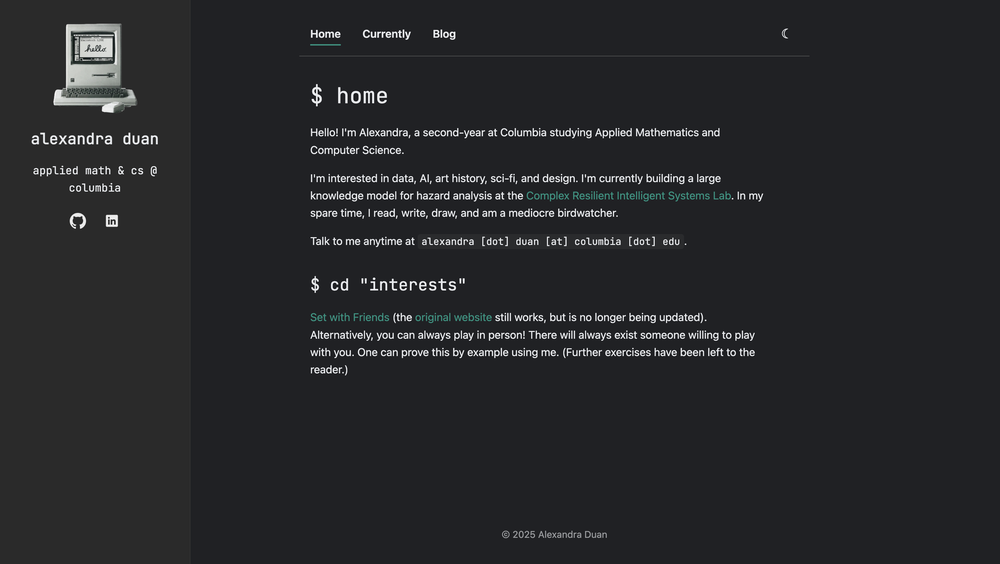

# Personal Website

## Overview
This is my [personal website](https://alexandraduan.wiki), a simple, minimalist theme featuring a sidebar, a theme toggle (light/dark), and content pages. Made with HTML/CSS, JavaScript, and Google Fonts. Currently working on integrating a Markdown reader.

## Setup & Usage
1. Clone or download the repository.
2. Open `index.html` or `blog.html` in any modern browser.
3. Modify content and styles in `style.css` and HTML files as needed.
4. Images and icons are stored in the `images/` folder; replace with your own assets as needed.

## Themes
You can toggle between a light and a dark theme using the sun/moon icon in the upper-right-hand corner.

|  |  |
| <small><em>Light mode</em></small> | <small><em>Dark mode</em></small> |
