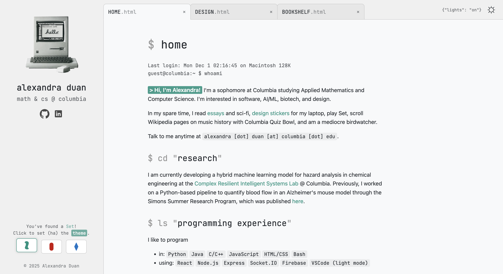
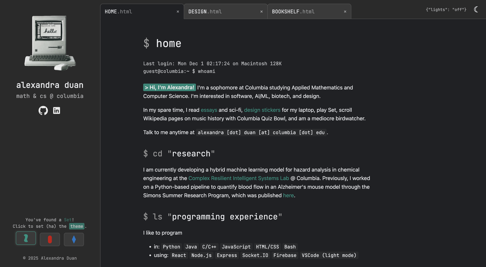

# Personal Website

This is my [personal website](https://alexandraduan.wiki), featuring a modern, responsive theme with tabbed navigation, dynamic theme switching, and interactive elements. Made with HTML/CSS and JavaScript.

## Setup & Usage
1. Clone or download the repository.
2. Open `index.html` in any modern browser.
3. Modify content and styles in `style.css` and HTML files as needed.
4. Images and icons are stored in the `images/` folder, and portfolio images are stored in `images/design/'. Replace with your own assets as needed.

## Themes
(1) Toggle between themes using the icon in the upper-right-hand corner. (I don't use dark mode, so it may be a bit uglier than its counterpart.)

   

   

(2) Toggle between theme colors by clicking the interactive Set cards in the sidebar.

   

