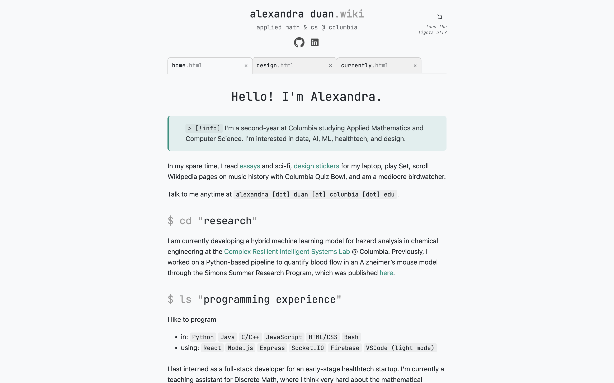
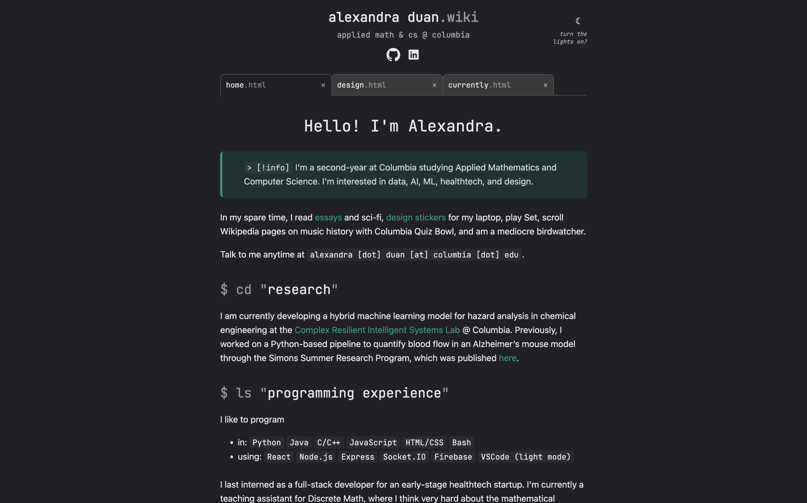
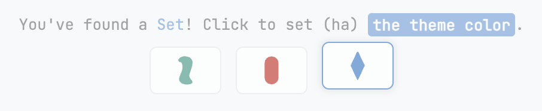
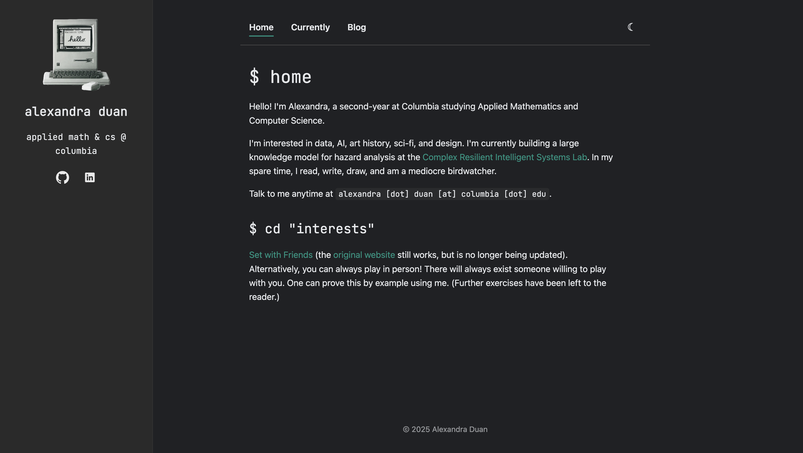

# Personal Website

This is my [personal website](https://alexandraduan.wiki), featuring a modern, responsive theme with tabbed navigation, dynamic theme switching, and interactive elements. Made with HTML/CSS and JavaScript.

## Setup & Usage
1. Clone or download the repository.
2. Open `index.html` in any modern browser.
3. Modify content and styles in `style.css` and HTML files as needed.
4. Images and icons are stored in the `images/` folder, and portfolio images are stored in `images/design/'. Replace with your own assets as needed.

## Themes
Toggle between the light and dark themes using the sun or moon icon in the header.

   
  <em>Light mode</em>

   
  <em>Dark mode</em>

Toggle between theme colors by clicking the interactive Set cards in the footer.

   

## Themes (Old)
The website's old theme, featuring a mobile-friendly sidebar, can be forked from the `old-with-sidebar` branch.

   
  <em>Light mode</em>

   
  <em>Dark mode</em>

